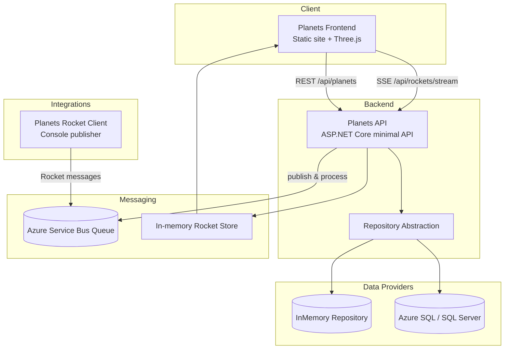

# Planets App

An interactive demo that combines a Three.js frontend with an ASP.NET Core backend to visualize the solar system and stream live "rocket" launch events. It showcases modern cloud-ready patterns such as pluggable data providers, optional Azure Service Bus integration, and real-time Server-Sent Events (SSE).

## Architecture Overview



- The frontend (`planets-frontend/`) is a static site that renders planets with Three.js, fetches planet metadata from the API, and listens for live rocket events over SSE.
- The backend (`planets-backend/`) exposes minimal APIs for planet data, health checks, and rocket message broadcasts. It selects either an in-memory or SQL-backed repository at startup via `PlanetRepository:Provider` configuration.
- Rocket events are published internally via an `IRocketPublisher` abstraction. In local/dev mode messages stay in-memory; when Azure Service Bus settings are provided, the app enqueues and processes messages through a queue while still fanning out to SSE subscribers.
- The optional console client (`planets-rocket-client/`) is a quick way to seed the queue with rocket launches when running against Service Bus.

## Getting Started

1. **Restore & build** (from `planets-app/`):
   ```pwsh
   dotnet restore
   dotnet build
   ```
2. **Run the API**:
   ```pwsh
   dotnet run --project planets-backend/Planets.Api.csproj
   ```
   The API defaults to in-memory data and runs on `http://localhost:5089` (see `Properties/launchSettings.json`).
3. **Serve the frontend**: host the contents of `planets-frontend/` with any static file server and set `window.API_BASE_URL` (via `config/api-base.js`) to the API origin.

## Configuration

- `planets-backend/appsettings.json` configures the in-memory defaults and optional Service Bus/SQL settings.
- Override values with environment variables. Examples:
  - `PlanetRepository__Provider=Sql`
  - `SqlConnectionFactory__ConnectionString="<Azure SQL connection string>"`
  - `ServiceBus__ConnectionString="<namespace connection string>"`
  - `ServiceBus__QueueName=rocket-messages`
  - `ServiceBus__UseManagedIdentity=true`
- When running with Azure SQL, the `PlanetDbInitializer` hosted service applies schema and seed data (`Data/Sql/planets.sql`).

## Rocket Messaging Modes

- **In-memory (default):** great for local demos; SSE events emit immediately within the process.
- **Azure Service Bus:** provide connection info to decouple publishers and processors. The API both emits messages and runs a background processor that pushes queue messages back to the in-memory store for SSE fan-out.
- **External producer:** Run `dotnet run --project planets-rocket-client/Planets.RocketClient.csproj` with the necessary Service Bus environment variables to simulate traffic.

## Testing

Unit tests live in `planets-backend.tests/`. Execute them with:
```pwsh
dotnet test Planets.sln
```

## Deployment Notes

- Container definitions (`Dockerfile`) exist for the API and frontend.
- CI/CD samples for building and deploying images are under `planets-frontend/.pipelines/`.
- Kubernetes manifests reside in `planets-frontend/.k8s/` as a starting point for cluster deployment.
